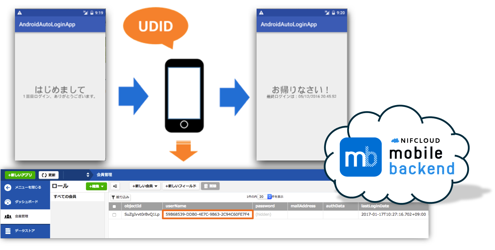
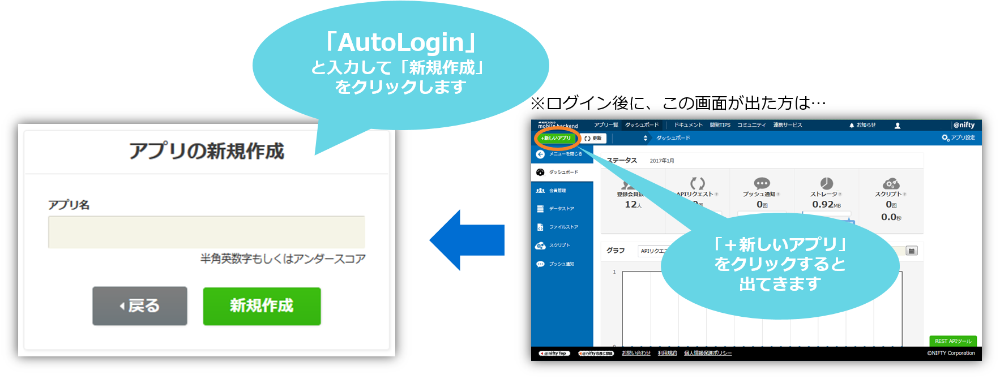
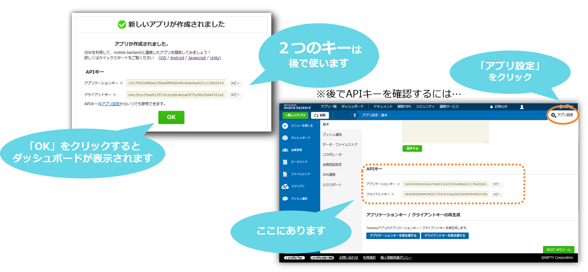
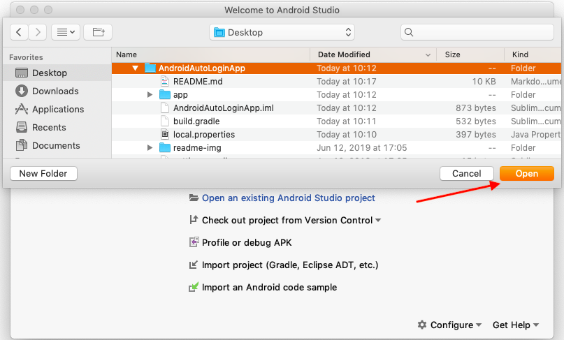
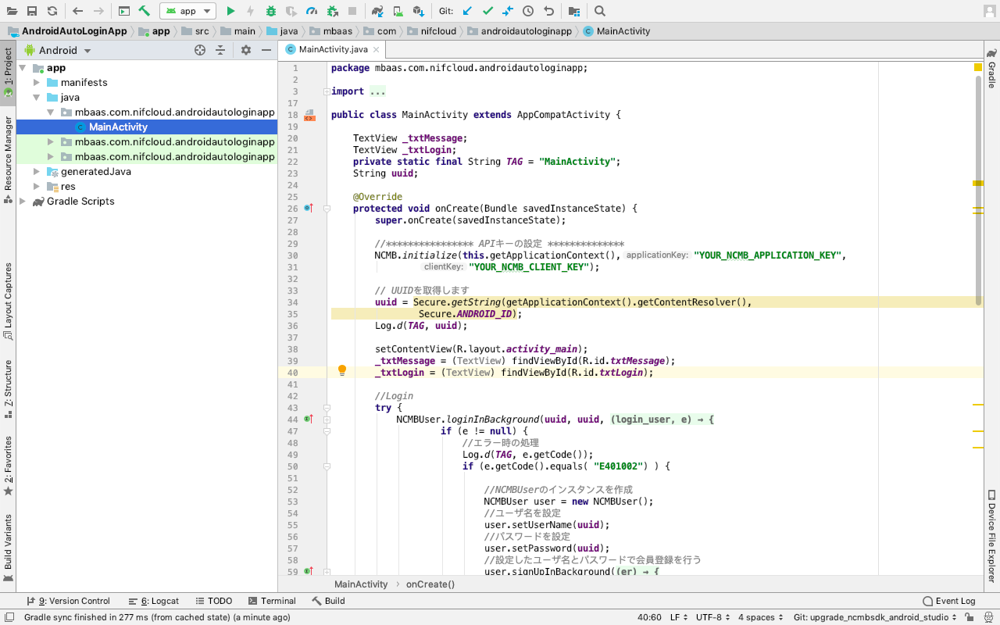
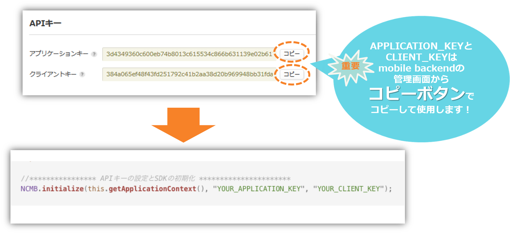
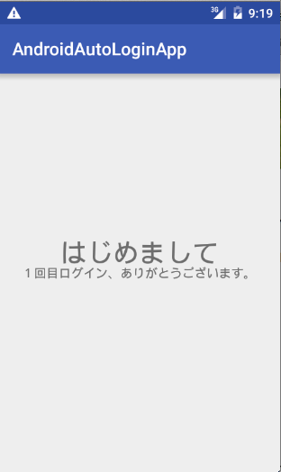
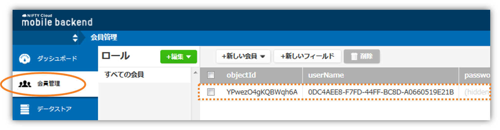
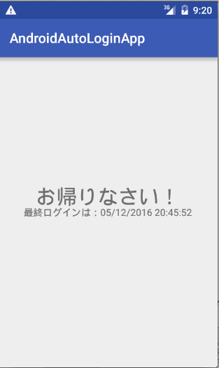
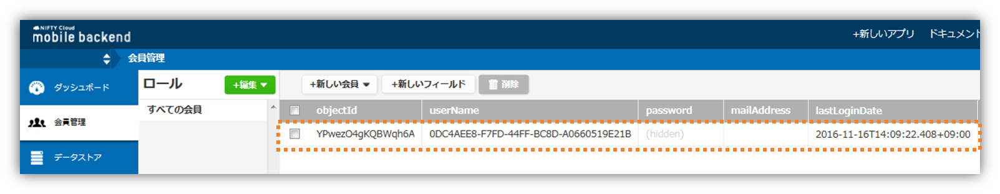

# 【Android】自動ログイン機能を実装しよう！ for Java


## 概要
* [ニフクラ mobile backend](https://mbaas.nifcloud.com/) の『会員管理機能』を利用して、ゲームアプリによく見られる「自動ログイン機能」を実装したサンプルプロジェクトです
  - 「自動ログイン機能」とは、ユーザーが会員登録やログイン/ログアウトを意識することなく会員管理を行う機能です
  - 通常の「会員管理機能」を応用して実装することが可能です
* 簡単な操作ですぐに [ニフクラ mobile backend](https://mbaas.nifcloud.com/) の機能を体験いただけます

## ニフクラ mobile backendって何？？
スマートフォンアプリのバックエンド機能（プッシュ通知・データストア・会員管理・ファイルストア・SNS連携・位置情報検索・スクリプト）が**開発不要**、しかも基本**無料**(注1)で使えるクラウドサービス！

注1：詳しくは[こちら](https://mbaas.nifcloud.com/price.htm)をご覧ください


## 動作環境

* MacOS Big Sur 11.6 
* Android Studio Arctic Fox 2020.3.1
* Pixle 3 - Android 12 (Simulator)

※上記内容で動作確認をしています。

## 手順
### 1. ニフクラ mobile backend の会員登録・ログインとアプリの新規作成
* 下記リンクから会員登録（無料）をします
  * https://console.mbaas.nifcloud.com/signup
* 登録ができたら下記リンクからログインします
  * https://console.mbaas.nifcloud.com/
* 下図のように「アプリの新規作成」画面が出るのでアプリを作成します
  * 既に mobile backend を利用したことがある方は左上の「＋新しいアプリ」をクリックすると同じ画面が表示されます



* アプリ作成されるとAPIキー（アプリケーションキーとクライアントキー）が発行されます
* この２種類のAPIキーはこの後ダウンロードするサンプルアプリと ニフクラ mobile backend を紐付けるため、あとで使います



### 2. サンプルプロジェクトのダウンロード
* 下記リンクをクリックしてプロジェクトをダウンロードします
 * https://github.com/NIFCLOUD-mbaas/AndroidAutoLoginApp/archive/master.zip
* ダウンロードしたプロジェクトを解凍します
* AndroidStudio を開きます、「Open an existing Android Studio project」をクリックして解凍したプロジェクトを選択します



* 選択したプロジェクトが開かれます



### 3. SDKの導入（実装済み）

※このサンプルアプリには既にSDKが実装済み（下記手順）となっています。（ver.3.0.0)<br>　最新版をご利用の場合は入れ替えてご利用ください。

* SDKダウンロード
SDKはここ（[SDK リリースページ](https://github.com/NIFCLOUD-mbaas/ncmb_android/releases)）から取得してください.
  - NCMB.jarファイルがダウンロードします。
* SDKをインポート
  - app/libsフォルダにNCMB.jarをコピーします
* 設定追加
  - app/build.gradleファイルに以下を追加します
```gradle
dependencies {
    implementation 'com.google.code.gson:gson:2.3.1'
    implementation files('libs/NCMB.jar')
}
```
  - androidManifestの設定
    - <application>タグの直前に以下のpermissionを追加します
```html
<uses-permission android:name="android.permission.INTERNET" />
<uses-permission android:name="android.permission.ACCESS_NETWORK_STATE" />
```

### 4. APIキーの設定
* AndroidStudio で MainActivity.java を開きます
  * ディレクトリはデフォルトで「Android」が選択されていますので、「Project」に切り替えてから探してください


* APIキー（アプリケーションキーとクライアントキー）の設定をします



* それぞれ`YOUR_APPLICATION_KEY`と`YOUR_CLIENT_KEY`の部分を書き換えます
   - このとき、ダブルクォーテーション（`"`）を消さないように注意してください！
* 書き換え終わったら保存してください
   * Windowsの場合、Ctrl + Sで保存できます。
   * Macの場合、command + Sで保存できます。

### 5. 動作確認と解説

* エミュレーターでアプリをビルドします
 * 失敗する場合は一度「Clean Project」を実行してから再度ビルドしてください
* アプリが起動します

#### 初回起動時
ユーザー側では特に操作をすることなく、裏では新規会員登録とログインが行われます

##### アプリ側
* 画面は次のようになります



##### クラウド側
* [ニフクラ mobile backend](https://mbaas.nifcloud.com/) の管理画面を確認してみましょう
* 「会員管理」の中にユーザー登録がされていることが確認できます



* [ニフクラ mobile backend](https://mbaas.nifcloud.com/) の「ユーザー名/パスワード」を使用して会員管理を行う機能を「自動ログイン機能」へ応用しています
 * ここでは、ユーザー名とパスワードとして、「端末ID（UDID）」を取得し起動時に認証を行うことで自動ログインを実現しています。
 * ダッシュボードの「userName」フィールドで登録された端末IDが確認できます。

#### ２回目以降起動時
初回起動時に端末IDで会員情報が登録されているため、２回目以降起動時はログインが行われます

* 上の「■」ボタンをクリックしてプログラムを停止します
* 再度、実行ボタン（さんかくの再生マーク）をクリックします

##### アプリ側
* 画面は次のようになります



* [ニフクラ mobile backend](https://mbaas.nifcloud.com/) の会員機能では会員毎に、会員登録やログインを行うたびに更新される「lastLoginDate」というフィールドを持ち、最終ログイン日時を表示します



* 何度か起動し、アプリ側とダッシュボード側を確認してみましょう

## 参考
ここではサンプルアプリに実装済みの内容について紹介します

### SDKのインポートと初期設定

ニフクラ mobile backend のドキュメント（クイックスタート）をご用意していますので、ご活用ください
* [Androidのクイックスタート](https://mbaas.nifcloud.com/doc/current/introduction/quickstart_android.html#/Android/)


### ロジック
* `activity_main.xml`でデザインを作成し、`MainActivity.java`にロジックを書いています

#### 自動ログイン処理
```java
// UUIDを取得します
uuid = Secure.getString(getApplicationContext().getContentResolver(),
        Secure.ANDROID_ID);
Log.d(TAG, uuid);

setContentView(R.layout.activity_main);
_txtMessage = (TextView) findViewById(R.id.txtMessage);
_txtLogin = (TextView) findViewById(R.id.txtLogin);

//Login
try {
    NCMBUser.loginInBackground(uuid, uuid, new LoginCallback() {
        @Override
        public void done(NCMBUser login_user, NCMBException e) {
            if (e != null) {
                //エラー時の処理
                Log.d(TAG, e.getCode());
                if (e.getCode().equals( "E401002") ) {

                    //NCMBUserのインスタンスを作成
                    NCMBUser user = new NCMBUser();
                    //ユーザ名を設定
                    user.setUserName(uuid);
                    //パスワードを設定
                    user.setPassword(uuid);
                    //設定したユーザ名とパスワードで会員登録を行う
                    user.signUpInBackground(new DoneCallback() {
                        @Override
                        public void done(NCMBException er) {
                            if (er != null) {
                                //会員登録時にエラーが発生した場合の処理
                                Log.d(TAG, "Signup error" + er);
                            }
                            else {
                                _txtMessage.setText("はじめまして");
                                _txtLogin.setText("１回目ログイン、ありがとうございます。");
                                //lastLoginを更新します（ラストログインのタイミングを取得するために）
                                try {
                                    NCMBUser curUser = NCMBUser.getCurrentUser();
                                    Date now = new Date();
                                    curUser.put("lastLoginDate", now);
                                    curUser.save();
                                } catch (NCMBException e1) {
                                    e1.printStackTrace();
                                }
                            }
                        }
                    });
                };
            } else {
                NCMBUser curUser = NCMBUser.getCurrentUser();

                Date lastLogin = curUser.getDate("lastLoginDate");
                SimpleDateFormat simpleDate =  new SimpleDateFormat("dd/MM/yyyy HH:mm:ss");
                String strDt = simpleDate.format(lastLogin);
                _txtMessage.setText("お帰りなさい！");
                _txtLogin.setText("最終ログインは：" + strDt);

                //lastLoginを更新します（ラストログインのタイミングを取得するために）
                try {
                    Date now = new Date();
                    curUser.put("lastLoginDate", now);
                    curUser.save();
                } catch (NCMBException e1) {
                    e1.printStackTrace();
                }
            }
        }
    });
} catch (NCMBException e) {
    e.printStackTrace();
}
```
